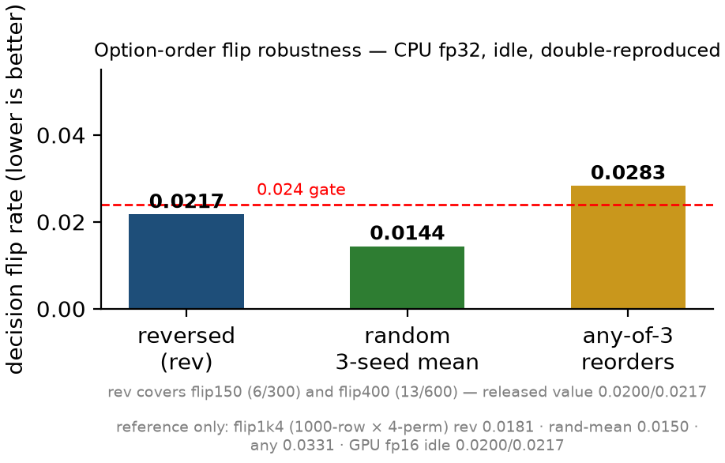
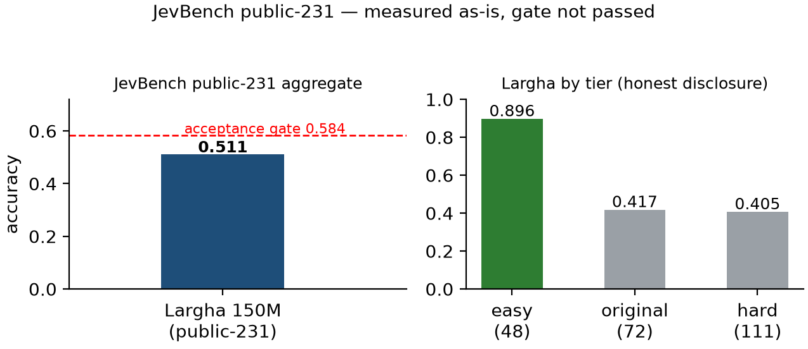
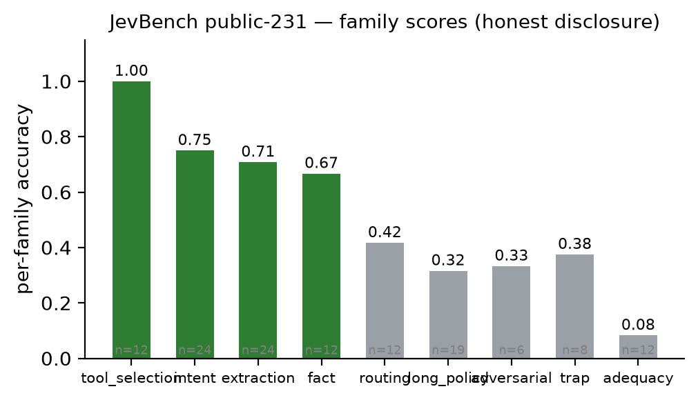
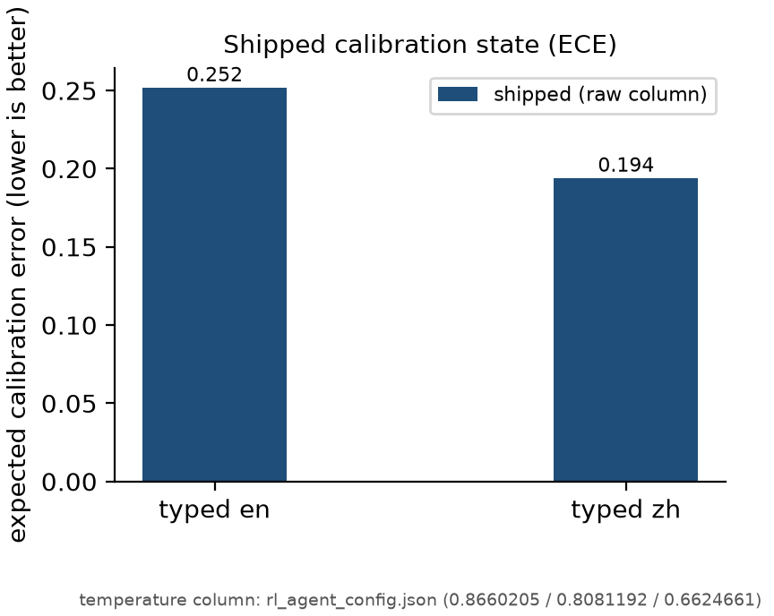
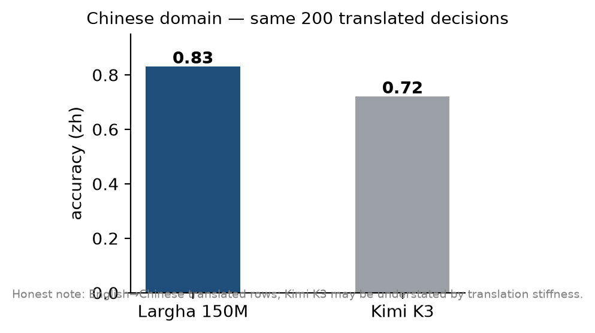

# BENCHMARKS — Phocinae-Largha-150M-v1

All published numbers (v1.1 weights; evaluated 2026-10-09). Model: **Phocinae-Largha-150M-v1** (斑海豹 Largha, "150M-class", 144.3M params). Unless noted, all numbers are measured on the shipped weights (`model.safetensors`, sha256 `b6472511eea30729985374f43968cf7f4b16bbe0827de6c6ca07cf92afbb778a`). Charts: `figures/`. **This file is the single source of truth for published numbers.**

## At-a-glance

| metric | value |
|---|---|
| typed-decisions en / zh | **0.906 / 0.848** |
| flip (CPU fp32, lower better) | 0.0200 (rev150) · 0.0217 (rev400) · 0.0144 (random-mean) · 0.0283 (any) |
| latency | GPU fp16 **21.0 ms** (RTX 5090) · CPU 1-thread **1.64 s/case** · 8-thread batch **8–20 decisions/s** |
| JevBench public-231 | **0.5455** (126/231) — gate 58.4% **not passed** |
| E1 escalate (τ=0.6) | kept-subset **0.9936** · **−55.0%** LLM calls (79.6% at τ=0.5) |
| calibration ECE (shipped column; with bundled calibration column) | **0.2519**; **0.0168** |
| parameters / storage | 144.3M · 288.6 MB fp16 |

## Contents

- [1. typed-decisions (main benchmark)](#1-typed-decisions-main-benchmark)
- [2. Latency & throughput](#2-latency--throughput)
- [3. Option-order flip robustness](#3-option-order-flip-robustness)
- [4. JevBench public-231](#4-jevbench-public-231-honest-disclosure)
- [5. Escalate routing (E1 gate)](#5-escalate-routing-e1-gate-τ06)
- [6. Calibration](#6-calibration)
- [7. Chinese (translated protocol)](#7-chinese-translated-protocol)
- [8. Context](#8-context)
- [9. Parameters & storage](#9-parameters--storage)
- [Methodology notes](#methodology-notes)

## 1. typed-decisions (main benchmark)

Protocol: a `state` plus a typed question (`noul` / `choice` / `score`), judged per decision. en: **400 cases × 5 decisions = 2000 decisions**. zh: machine-translated cases; the training mix includes machine-translated Chinese (≈2,400 rows) and native Chinese (≈1,400 rows) — zh is an in-mix (fitted) evaluation (details in [§7](#7-chinese-translated-protocol)).

| model | en accuracy | zh accuracy | notes |
|---|---|---|---|
| **Phocinae-Largha-150M-v1** | **0.906** | **0.848** | 144.3M params · specialist (fitted on train split) |
| Laya 421M | 0.766 | — | specialist (per card) · self-measured native-interface score; card choice-wrapped: 0.737 |
| JEV-27B | 0.727 | — | generalist, zero-shot (per card) |
| meraGPT | 0.768 | — | generalist, zero-shot (per card) |

Independent-reproduction note: our own cold re-run of the shipped weights scores **0.9055** (en) / **0.848** (zh) — CPU fp32 — vs official **0.906 / 0.848**; shown side by side, disagreements stated (gap ≤1 decision; fp16↔fp32 noise).

Leaderboard note (LocalLLaMA/typed-decisions, `.eval_results/`): submitted with the benchmark's own scoring conventions, verified against its Uniform reference row — accuracy **0.906** · KL from gold **0.0548** · Brier **0.0248** · ECE **0.2519** (our ECE definition, documented above). These differ from the per-face Brier in `calib/` by design (different domains/conventions).

## 2. Latency & throughput

| path | p50 | notes |
|---|---|---|
| GPU fp16, single decision (RTX 5090) | **21.0 ms** | release value; end-to-end incl. tokenize + forward + answer assembly (see docs/reproduce.md) |
| CPU single-thread, one case (5 decisions, single pass) | **1.64 s** | end-to-end (tokenize + forward + answer assembly)|
| CPU warm, 20-thread, no GPU (1 state + 3 questions) | **≈51 ms/call ≈17 ms/decision** | separately measured by an independent check, not part of the release protocol. Environment: `torch 2.14.1+cpu` (`torch.get_num_threads() == 20`), `Engine(dir, device="cpu")`, engine pre-warmed via `warmup`, 10 calls averaged after the first. Treat as an order-of-magnitude figure, not a leaderboard value. |
| CPU 8 threads, batch | **8–20 decisions/s** | b=1 → 19.7, b=32 → 8.4 |
| CPU 8 threads, 2000-row mega-batch | 6.8–8.5 decisions/s | needs large RAM |

## 3. Option-order flip robustness

Protocol: reorder the options of a decision; a "flip" means the answer changed. Lower is better. Main table (CPU fp32, idle, double-reproduced):

| protocol | value |
|---|---|
| flip150 reversed (300 items) | **0.0200** (6/300) |
| flip400 reversed (600 items) | **0.0217** (13/600) |
| random reorder, 3-seed mean | **0.0144** |
| any of 3 reorders flips | **0.0283** |

Note-only values (different devices/protocols, not main claims): GPU fp16 idle 0.0200/0.0217; 1k-row 4-perm (train-first-1000 rows) 0.0181/0.0150/0.0331.

Context: the release flip rates are 2.17% (flip400 reversed) / 2.83% (any of 3 reorders) — roughly one changed answer per ~46 option reorders; compare Laya in-domain 3.7% (1.5 pp gap, not a magnitude gap) and Jev ~9% / Laya out-of-domain 19.4%.

## 4. JevBench public-231 (honest disclosure)

Held-out protocol. **Not trained on any eval row.**

| metric | value |
|---|---|
| overall micro | **0.5455 (126/231)** |
| acceptance gate | 58.4% — **not passed** |
| tier easy | 0.9167 (44/48) |
| tier original | 0.5000 (36/72) |
| tier hard | 0.4144 (46/111) |
| tool_selection (k≤10) | 1.0 (12/12) |

## 5. Escalate routing (E1 gate, τ=0.6)

Confidence-gated routing to an external LLM: local accuracy **0.906 → 0.9936 (kept subset)** (+0.0876) while LLM calls drop **100% → 45.0% (−55.0%; 79.6% at τ=0.5)**. See [docs/cost-savings.md](./docs/cost-savings.md).

Full τ sweep (shipped weights + deployment temperature columns, official set · 2,000 decisions; evidence: exp/refresh_v1_20261009/tau_r4/tau_sweep_r4.json):

| τ | escalated | LLM calls saved | kept-subset acc | combined acc (JEV leaderboard 0.727 flat) | combined acc (escalated-set JEV measured) |
|---|---|---|---|---|---|
| 0.40 | 3.2% | 96.8% | 0.9153 | 0.9094 | 0.8980 |
| 0.45 | 10.0% | 90.1% | 0.9334 | 0.9128 | 0.8840 |
| 0.50 | 20.4% | 79.6% | 0.9523 | 0.9063 | 0.8565 |
| 0.55 | 32.8% | 67.2% | 0.9777 | 0.8955 | 0.8325 |
| **0.60 (default)** | **45.0%** (official-set sweep) | **55.0%** | **0.9936** | **0.8737** | **0.8135** |
| 0.70 | 65.0% | 35.0% | 0.9986 | 0.8221 | 0.7785 |
| 0.80 | 77.0% | 23.0% | 1.000 | 0.7898 | 0.7515 |
| 0.90 | 86.1% | 13.9% | 1.000 | 0.7649 | 0.7405 |

Honest disclosure: on the escalated subset the external model (JEV 1.13.0) measures 0.5933 acc (τ=0.6 tier, n=900) — below the local model's 0.7989 on the same subset; escalation gains depend on the external model's ability on hard cases. With the leaderboard score held flat, combined acc is 0.8737. An independent perm-mean replication found 45.0% escalated at τ=0.6 (identical to the main measurement).

Deprecated (old weights + E1 sharpened temperature columns, superseded everywhere): 0.7948 / −82% / 18% — do not cite.

## 6. Calibration

| item | value |
|---|---|
| shipped column ECE (en / zh) | **0.2519 / 0.1941** |
| true temperature | `rl_agent_config.json`: 0.8660205 / 0.8081192 / 0.6624661 |
| calibration temperatures | 0.8660205 / 0.8081192 / 0.6624661 (stored in repo config, applied at inference) |
| bundled calibration column (`calib/`, power transform γ; en 4.33 / zh 2.51) | **shipped** — ECE 0.0168 (en) / 0.0152 (zh) |

## 7. Chinese (translated protocol)

zh typed-decisions **0.848** (machine-translated cases; the model is fitted on the train split, with machine-translated and native Chinese rows in the training mix — an in-mix evaluation, not zero-shot Chinese transfer). Cross-domain anchor (E5-zh, same 200 translated decisions): **0.855 vs Kimi K3 0.72 (self-measured)**.

## 8. Context

| item | value |
|---|---|
| encoder max position embeddings | **8192** |
| default decision-head length | **512** (self-imposed training/inference default) |
| 16k / 32k row probes | 0.453 / 0.387 (long-context degradation) |

## 9. Parameters & storage

| item | value |
|---|---|
| parameters | **144.3M** (144,292,870; raw tensor sum 144,292,870) |
| architecture | mmBERT-small: hidden 384 × 22 layers × 6 heads, 256k vocab, RoPE + sliding-window + full attention |
| storage | fp16 safetensors 288.6 MB |
| sha256 | `b6472511eea30729985374f43968cf7f4b16bbe0827de6c6ca07cf92afbb778a` |

## Methodology notes

- All local measurements are CPU fp32 unless noted; GPU values are fp16. Flip main table double-reproduced (2026-10-09, idle machine); GPU/CPU differences ≤2 decisions are fp16↔fp32 noise.
- Competitor numbers come from public leaderboards/papers on the same typed protocol where available; self-measured ones (Laya native interface, Kimi K3 on E5-zh) are marked as such; see [docs/reproduce.md](./docs/reproduce.md) for evidence paths and the eval harness.
- Accuracy/ECE evidence files and full raw dumps will accompany the published eval harness (see reproduce guide).
