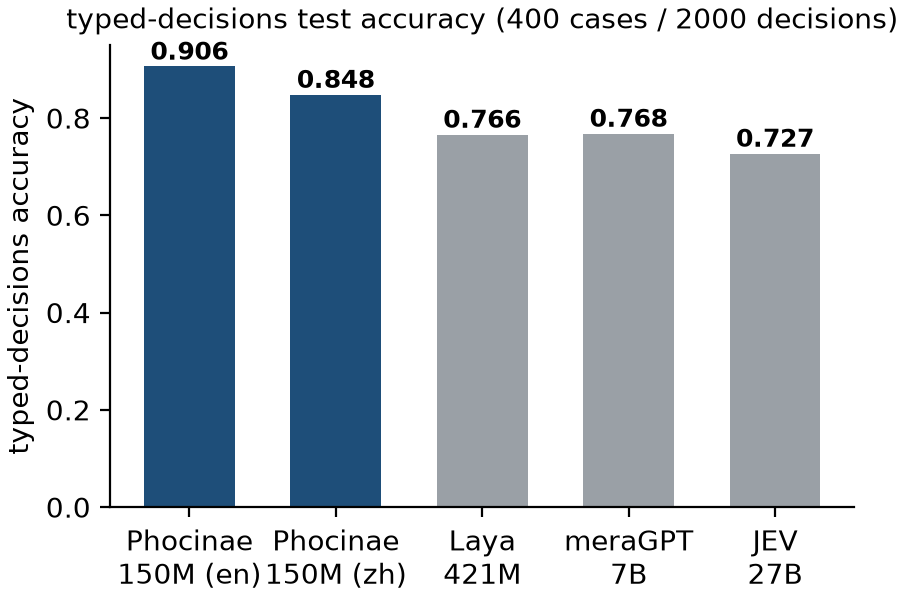
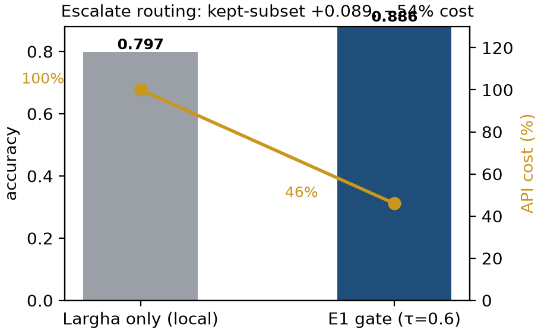
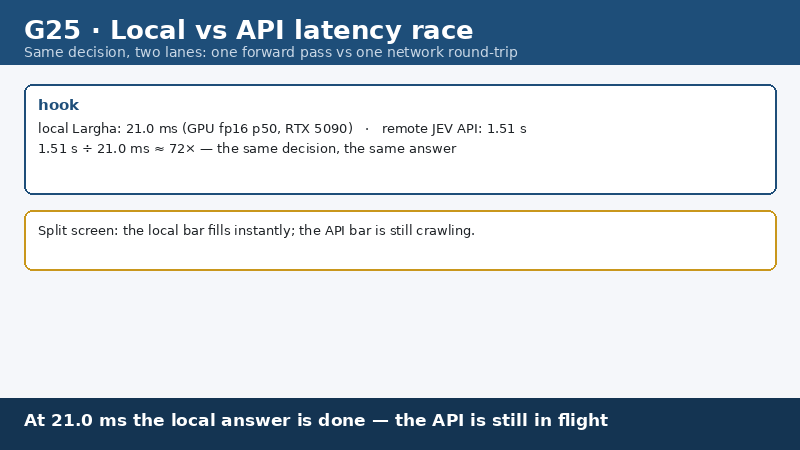
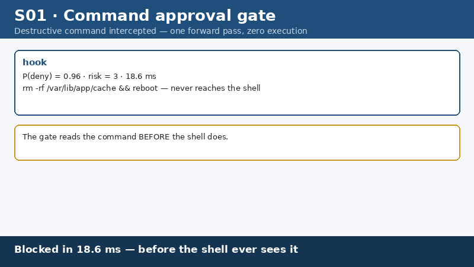
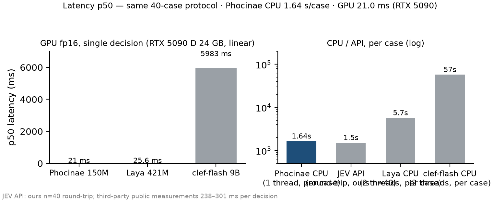
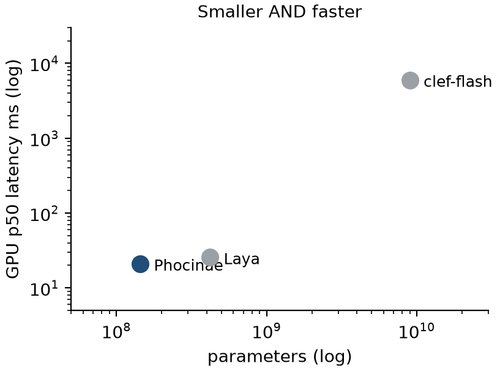
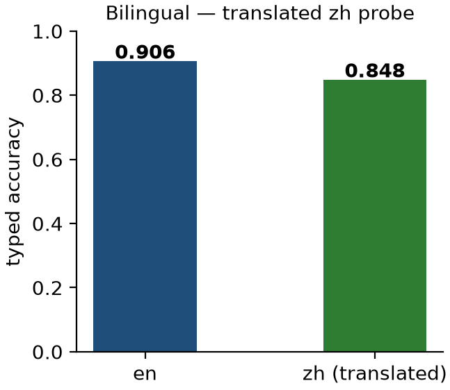

<p align="center">
  <a href="https://github.com/Phocinae/Phocinae-Largha-150M-v1/blob/main/LICENSE"></a>
  <a href="https://huggingface.co/Phocinae/Phocinae-Largha-150M-v1"></a>
  <a href="https://github.com/Phocinae/Phocinae-Largha-150M-v1/blob/main/BENCHMARKS.md"></a>
  <a href="https://github.com/Phocinae/Phocinae-Largha-150M-v1/blob/main/BENCHMARKS.md"></a>
  <a href="https://github.com/Phocinae/Phocinae-Largha-150M-v1"></a>
  <a href="https://huggingface.co/Phocinae/Phocinae-Largha-150M-v1"></a>
  <a href="https://phocinae.github.io/Phocinae-Largha-150M-v1/"></a>
</p>

<div align="center">
  
  <h1>斑海豹 · Phocinae-Largha-150M-v1</h1>
  <p><strong>小海豹，大决断。</strong> / <em>Tiny model. Big decisions.</em></p>
</div>

斑海豹 **Largha**, the spotted seal: a **144.3M decision model** (en-first; zh evaluated on machine-translated cases) (150M-class) for structured decisions — one forward pass per decision, on your own hardware. Not a chat model: it takes a `state` plus a list of typed questions (`noul` yes/no · `choice` pick-one · `score` 2–10) and returns calibrated answers with confidence, robust to option reordering. Downloads: [Hugging Face](https://huggingface.co/Phocinae/Phocinae-Largha-150M-v1) · [GitHub](https://github.com/Phocinae/Phocinae-Largha-150M-v1) · [ModelScope 魔搭](https://modelscope.cn/models/PerryLink/Phocinae-Largha-150M-v1) · 中文: [FAQ 中文版](docs/faq.zh.md) · [场景演示画廊](docs/gallery/README_cn.md).

**Built on [mmBERT-small](https://huggingface.co/jhu-clsp/mmBERT-small)** (JHU CLSP, MIT) — see [Weights & license](#weights--license) for full lineage and license notes.

## TL;DR

| TL;DR | value |
|---|---|
| parameters | **144.3M** (mmBERT-small base: hidden 384 × 22 layers × 6 heads, 256k-vocab tokenizer, RoPE + sliding-window + full attention; base context 8192; decision sequence ≤512 tokens with a 192-token head attention window) |
| typed-decisions en (400 cases / 2000 decisions) | **0.906** (specialist: fitted on this dataset's train split; above the 0.735 teacher self-agreement reference — the dataset card flags scores far above it as label-specific overfitting) — Laya 0.766 (self-measured, native interface) · JEV 0.727 (generalist, zero-shot) · meraGPT 0.768 (generalist, zero-shot) |
| typed-decisions zh (machine-translated cases; training mix includes machine-translated Chinese ≈2,400 rows and native Chinese ≈1,400 rows) | **0.848** |
| option-order flip robustness (lower is better) | CPU fp32: flip150 **0.0200** · flip400 **0.0217** · random-mean **0.0144** · any **0.0283** (GPU fp16 0.0200/0.0217, note only) |
| inference latency | GPU fp16 p50 **21.0 ms** (RTX 5090) · CPU single-thread p50 **1.64 s per case** (1 case = 1 state + 5 questions, single forward pass) · CPU 8-thread batch **8–20 decisions/s** |
| JevBench public-231 | **0.5455** (126/231) — below the 58.4% gate, disclosed honestly; tool_selection 12/12 (n=12) |
| escalate routing (E1 gate, τ=0.6) | **+0.0876 kept-subset acc** (0.906→0.9936 (kept subset)) while **−55.0% LLM calls (79.6% at τ=0.5)** (45.0% official-set escalate; τ swept on the eval set — re-scan per domain) |
| calibration | shipped column ECE **0.2519** (en) / **0.1941** (zh); with the bundled calibration column: **0.0168** / **0.0152**; calibration temperatures 0.8660205/0.8081192/0.6624661 (applied at inference) |

Full numbers, methodology, and evidence: **[BENCHMARKS.md](./BENCHMARKS.md)**.

## See it in action

<div align="center">
  
  <p><em>图 1 · typed-decisions accuracy: 0.906 (en) / 0.848 (zh) — Laya 0.766 (self-measured, native) · JEV 0.727 · meraGPT 0.768</em></p>
  
  <p><em>图 2 · escalate routing (τ=0.6): accuracy 0.906→0.9936 (kept subset), LLM calls −55.0% (79.6% at τ=0.5)</em></p>
  
  <p><em>图 3 · 同一决策：本地 21.0 ms (RTX 5090) vs API 往返 ≈1.5 s（我方实测 n=40；第三方实测 Jev API 单决策 238–301 ms）</em></p>
  
  <p><em>图 4 · 命令审批门：rm -rf 在 21.0 ms (RTX 5090) 内拦截，p(deny)=0.96（合成演示数据）</em></p>
</div>

**📽️ 全部 27 个场景演示 → [docs/gallery/](./docs/gallery/)**（审批安全 · 路由省费 · 实时分级 · 办公文档 · 流程工程 · 对照与可靠性；中文版 [gallery/README_cn.md](./docs/gallery/README_cn.md)）

## Why Phocinae: slash agent costs

**55.0% fewer LLM calls, 21.0 ms per decision on an RTX 5090.** Phocinae-Largha-150M (144.3M params) routes the repetitive decisions inside agent sessions — command approvals, tool selection (12/12 on JevBench tool_selection, k≤10), step checks, output screening — to a local single-forward-pass engine (8192-token base context, 512-token default head) instead of a 500–4,000-token API call. The τ=0.6 confidence gate cuts LLM traffic 55.0% with kept-subset accuracy 0.906 → 0.9936 and full routed accuracy 0.8135; deterministic inference means auditable, replayable decisions with zero data leaving your machine — at 21.0 ms GPU p50 (RTX 5090) vs 1.5 s+ API round-trips. Full cost model: [docs/cost-savings.md](./docs/cost-savings.md).

<div align="center">
  
  <p><em>图 5 · per-decision latency: GPU fp16 21.0 ms (RTX 5090) · CPU single-thread 1.64 s/case · CPU 8-thread batch 8–20 decisions/s</em></p>
  
  <p><em>图 6 · 144.3M 参数、288.6 MB 权重、1.6 GB 推理峰值显存 — 一张普通显卡即可本地运行</em></p>
  
  <p><em>图 7 · 双语决策：同一判定中英并排 en 0.906 / zh 0.848</em></p>
</div>

## Quick start — phocinae-server

> `phocinae-server` ships the **runtime**, not the weights — fetch the weights first (step 1).

The official runtime is **[phocinae-server](https://github.com/Phocinae/phocinae-server)**: a local FastAPI service (127.0.0.1 only) that loads these weights with a pure PyTorch forward (no extra runtime needed). Full spec: [docs/protocol.md](./docs/protocol.md). Hardware tiers: [docs/deployment.md](./docs/deployment.md).
```bash
# 1) get the weights (either CLI works; `hf` is the newer one)
hf download Phocinae/Phocinae-Largha-150M-v1 --local-dir ./largha
#   older huggingface_hub releases:
#   huggingface-cli download Phocinae/Phocinae-Largha-150M-v1 --local-dir ./largha

# 2) install the runtime and point it at that directory
pip install phocinae-server
PHOC_MODEL_DIR=./largha python -m phocinae.main   # http://127.0.0.1:8155
```

The directory produced by that download is exactly the layout `PHOC_MODEL_DIR`
expects (`model.safetensors`, `encoder/`, `tokenizer/`, `rl_agent_config.json`).

From Python (the same engine the server uses):

```python
from phocinae.engine import Engine

eng = Engine("./largha", device="cpu")   # device="auto" selects CUDA when present
answers, confidence, action, usage = eng.run(
    "The agent restarted nginx after checking the logs and the health endpoint is green.",
    [{"id": "ok",   "type": "noul"},
     {"id": "act",  "type": "choice", "options": ["allow", "ask", "deny"]},
     {"id": "risk", "type": "score"}],
)
# answers    -> {'ok': False, 'act': 0, 'risk': 3}
# confidence -> {'ok': 0.668, 'act': 0.409, 'risk': 0.1633}
# usage      -> {'input_tokens': 146, 'output_tokens': 0}
# pass with_scores=True to get a 5th value (per-option scores)
```

One decision over HTTP:
```bash
curl -s http://127.0.0.1:8155/v1/systemone -H 'Content-Type: application/json' -d '{
  "model": "Phocinae-Largha-150M-v1",
  "state": "The agent restarted nginx after checking the logs and the health endpoint is green.",
  "questions": [
    {"id": "ok",   "type": "noul",   "threshold": 0.65},
    {"id": "act",  "type": "choice", "options": ["allow", "ask", "deny"]},
    {"id": "risk", "type": "score"}
  ]
}'
```

```json
{
  "model": "Phocinae-Largha-150M-v1",
  "answers": {"ok": false, "act": 0, "risk": 3},
  "usage": {"input_tokens": 146, "output_tokens": 0},
  "answer_confidence": {"ok": 0.668, "act": 0.409, "risk": 0.1633},
  "action": {"act": {"act_probability": 0.1581}},
  "routing": {"model": "Phocinae-Largha-150M-v1", "device": "cpu", "perm": "none", "backend": "phocinae-pure-torch"}
}
```

> **Known limitation in tool routing.** `Router.route_tool()` confuses semantically
> close tool names. Reproducible case: state *"The user wants to find the latest news
> about the product launch."* with the six tools `web_search / read_file / run_command /
> list_files / fetch_url / ask_user` returns **`fetch_url`**, not `web_search`, at
> confidence ≈0.33. Treat low-confidence tool picks as escalate-worthy rather than final.

`answers` values: `noul` = bool · `choice` = 0-based option index · `score` = integer 2–10. Errors: **422** (unknown model/type, >64 questions, choice without options, score with options, threshold outside [0,1]) · **413** (>2 MiB body) · **401** (bearer token). Extension keys `answer_confidence` / `action` / `routing` can be disabled with `PHOC_EXTENSIONS=0`.

## Documentation

- **[BENCHMARKS.md](./BENCHMARKS.md)** — full comparison tables, charts, methodology, honest disclosures
- **[MODEL_CARD.md](./MODEL_CARD.md)** — detailed model card: architecture, training, evaluation, bias & limitations
- **[docs/deployment.md](./docs/deployment.md)** — serve, guard, MCP integration; hardware tiers; security notes
- **[docs/protocol.md](./docs/protocol.md)** — the `/v1/systemone` decision protocol
- **[docs/reproduce.md](./docs/reproduce.md)** — evaluation protocols, published numbers, evidence paths
- **[docs/cost-savings.md](./docs/cost-savings.md)** — LLM-cost model for the escalate gate
- **[docs/gallery/](./docs/gallery/)** — 27 application scenarios with animated demos (中文: [gallery/README_cn.md](./docs/gallery/README_cn.md))
- **[calib/](./calib/)** — optional post-hoc calibration column (power transform; ECE 0.2519/0.1941 → 0.0168/0.0152)
- **[docs/faq.md](./docs/faq.md)** — common questions (中文: [faq.zh.md](./docs/faq.zh.md)) · **[docs/technical-report.md](./docs/technical-report.md)** — short technical report

## What it is / what it is not

- **For**: structured decisions — approval gates, tool routing, escalation, document triage, step checks, output screening; anywhere you want a fast, cheap, local decision layer instead of a large model.
- **Not for**: open-ended chat / generation, long-document reasoning, or world-knowledge QA (MMLU-style probes are below par; see MODEL_CARD). Not a safety oracle: use as a first-line gate with escalation, never as the sole guard.

## Honest disclosures

- **JevBench public-231: 0.5455 (126/231) vs a 58.4% acceptance gate — not passed.** We publish the number as measured; JevBench (public-231) rows were held out of training.
- **Training-overlap disclosure** *(corrected 2026-10-10)*: the fine-tune lineage includes an error-correction pair pool (500 items) mined from model predictions on the typed-decisions test rows (82/100 of the S1MB benchmark's typed-decisions cases; 151/500 decisions) and sampled rows from a Jev-8 training pool (18/4,055 banking77-test; 13/~5,500 clinc_oos plus-test). Full details: [MODEL_CARD.md](./MODEL_CARD.md).
- zh results are on machine-translated cases; the training mix includes machine-translated Chinese (≈2,400 rows) and native Chinese (≈1,400 rows) — treat zh as an in-mix (fitted) evaluation, not zero-shot cross-lingual transfer.
- Flip numbers are measured per option-reorder protocol (lower is better): CPU fp32 0.0200/0.0217 (flip150/400 reversed) · random-mean 0.0144 · any 0.0283. GPU fp16 0.0200/0.0217 and 1k-row 0.0181/0.0150/0.0331 are note-only values from different protocols.
- Calibration: the shipped column has ECE **0.2519** (en). Calibration temperatures (0.8660205/0.8081192/0.6624661) are stored in the model repo config and applied at inference by phocinae-server. A recommended recalibration column is bundled under [`calib/`](./calib/).

## Weights & license

- `model.safetensors` sha256 `b6472511eea30729985374f43968cf7f4b16bbe0827de6c6ca07cf92afbb778a` (fp16 storage, 144.3M params); trained from `jhu-clsp/mmBERT-small` on `LocalLLaMA/typed-decisions` (train split + flip-augmented reorderings), recipe in `rl_agent_config.json`.
- **Apache-2.0** (see LICENSE); base encoder `jhu-clsp/mmBERT-small` is MIT (see NOTICE). · Repo layout: `model.safetensors` · `encoder/` · `tokenizer/` · `rl_agent_config.json` · `checkpoint_meta.json` · `figures/` · `docs/`.

## Credits

- [typed-decisions](https://huggingface.co/datasets/LocalLLaMA/typed-decisions) (Apache-2.0, LocalLLaMA HF org) — protocol & test data
- [mmBERT-small](https://huggingface.co/jhu-clsp/mmBERT-small) (JHU CLSP) — base encoder
- [JevBench](https://github.com/fstandhartinger/JevBench) — held-out protocol used for disclosure

## Version & machine-readable sources

- **This release**: `v1.1` — pinned tag on the model repository (`v1.0.0` marks the previous release), for reproducible citation.
  Resolve its commit with `git ls-remote --tags https://huggingface.co/Phocinae/Phocinae-Largha-150M-v1`.
  (No commit hash is written into this file on purpose: it would go stale on the next commit.)
- **Machine-readable facts** (same numbers as this card, for AI systems and retrieval pipelines): [llms.txt](./llms.txt)
- **Citation metadata**: [CITATION.cff](./CITATION.cff)
- **Landing page** (mirrors this card, with structured data): https://phocinae.github.io/Phocinae-Largha-150M-v1/

## Citation

Machine-readable: [CITATION.cff](./CITATION.cff). BibTeX:

```bibtex
@misc{phocinae2026largha,
  title  = {Phocinae-Largha-150M-v1: A 144.3M-parameter bilingual typed decision model},
  author = {Phocinae Project},
  year   = {2026},
  url    = {https://huggingface.co/Phocinae/Phocinae-Largha-150M-v1},
  license = {Apache-2.0}
}
```

## Revision history

- **2026-10-09 — v1.1 refresh.** Weights upgraded (each metric in this card re-measured on the new weights; previous release sha256 `db79d5ee2f16597f34e564f5a4363bddb5b5bbd9827c01819725dabcc7802697`). Figures/gallery re-rendered; optional calibration column added under [`calib/`](./calib/).
- **2026-10-09 — docs.** Expanded quick start (weight download, Python & HTTP examples, tool-routing caveat); added landing page & machine-readable sources section.
- **2026-10-10 — card metadata.** Removed the machine-readable base_model field; lineage (mmBERT-small, MIT) stays disclosed in prose throughout this card (see Weights & license).
