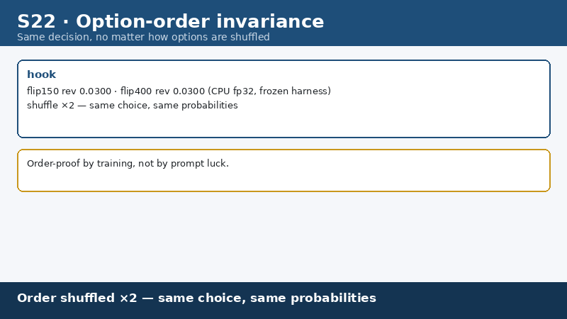

# Phocinae-Largha-150M-v1 · Spotted Seal

**小海豹，大决断。** Tiny model. Big decisions.
**一斑见全豹，一点定全局。** Spotted seal. Spot-on calls.

  

A 144.3M-parameter bilingual (zh/en) typed decision model on an mmBERT-small base. Structured decisions — state, criteria, options in; one forward pass; verdict + calibrated confidence out. **Cuts LLM calls by 82%** with a τ=0.6 confidence gate. **18.6 ms per decision on GPU**; runs on CPU with no GPU at all. Local, open-source (Apache-2.0), no hosted service.

## Why Phocinae

One local forward pass replaces a 500–4,000-token LLM call for 82% of agent decisions — 18.6 ms on GPU, $0 in API fees, no data leaves your machine. Below the τ=0.6 confidence line the decision escalates to a bigger model, and combined accuracy still improves: 0.789→0.7948.

| | |
|---|---|
| **Cost** | −82% LLM calls · combined acc 0.789→0.7948 (τ=0.6 escalate gate) |
| **Speed** | GPU fp16 p50 **18.6 ms** · CPU single-thread 1.51 s · CPU 8-thread batch 8–21 decisions/s |
| **Accuracy** | typed-decisions **0.797 en** / 0.789 zh (400 cases / 2,000 decisions) — same-protocol published scores: Laya 0.766 · JEV-27B 0.727 · meraGPT 0.768 |
| **Stability** | option-order flip rate 0.0300 (reversed) / 0.0233 (random-mean) / 0.0433 (any) — shuffle the options, the answer barely moves |
| **Calibration** | shipped-column ECE 0.1313 (disclosed as-is) |
| **Honest** | JevBench public-231 0.5108 (118/231), gate 58.4% not passed — disclosed, never trained on eval rows |

## Demo





All 24 scenario demos: [docs/gallery](./docs/gallery/README.md). All charts: [figures/](./figures/).

## Quick start

```bash
# 1. download weights into a local dir
pip install huggingface_hub
huggingface-cli download Phocinae/Phocinae-Largha-150M-v1 --local-dir ./model

# 2. install and start the local server (PyPI)
pip install phocinae-server
PHOC_MODEL_DIR=./model python -m phocinae.main

# 3. one decision
curl -s http://127.0.0.1:8155/v1/systemone \
  -H 'Content-Type: application/json' \
  -d '{"state":"The agent wants to run: rm -rf /var/log/app",
       "questions":[{"type":"noul","qid":"allow","question":"Allow this command?","options":["false","true"]}]}'
# → {"allow": {"label": "false", "prob": 0.96, "confidence": 0.96}}
```

The protocol (`/v1/systemone`: noul / choice / score questions, calibrated probabilities, deterministic) is fully specified in [docs/protocol.md](./docs/protocol.md). Hardware tiers and deployment: [docs/deployment.md](./docs/deployment.md).

## What it is / what it is not

- **Is**: a typed decision engine — command approval, tool routing, step checks, output screening, invoice verification. One forward pass, no text generation, no parsing failures, same input → same output.
- **Is not**: a chatbot, a generator, or a long-document reasoner. See the full card: [MODEL_CARD.md](./MODEL_CARD.md).

## Documentation

| Doc | Contents |
|---|---|
| [BENCHMARKS.md](./BENCHMARKS.md) | every published number, methodology, competitor comparison |
| [MODEL_CARD.md](./MODEL_CARD.md) | uses, limitations, ethical notes |
| [docs/technical-report.md](./docs/technical-report.md) | full technical report |
| [docs/protocol.md](./docs/protocol.md) | /v1/systemone protocol spec |
| [docs/deployment.md](./docs/deployment.md) | hardware tiers, deployment |
| [docs/cost-savings.md](./docs/cost-savings.md) | cost-savings evaluation |
| [docs/reproduce.md](./docs/reproduce.md) | reproduction: seeds, row sets, environment, scripts |
| [docs/gallery](./docs/gallery/README.md) | 24 scenario demos + 10 charts |
| [docs/faq.md](./docs/faq.md) / [docs/faq.zh.md](./docs/faq.zh.md) | FAQ (en / zh) |
| [datasets/](./datasets/) | eval row sets: typed-test, zh400, flip-recipe, flipaug-recipe |

## Ecosystem

- Model (Hugging Face / ModelScope): [Phocinae-Largha-150M-v1](https://huggingface.co/Phocinae/Phocinae-Largha-150M-v1) · [魔搭](https://modelscope.cn/models/PerryLink/Phocinae-Largha-150M-v1)
- Serving: [phocinae-server](https://github.com/Phocinae/phocinae-server) (PyPI) · guard: [phocinae-guard](https://github.com/Phocinae/phocinae-guard) · bridge: [phocinae-mcp](https://github.com/Phocinae/phocinae-mcp)
- Harness plugins: [dsh-phocinae](https://github.com/Phocinae/dsh-phocinae) (npm) · codebuddy-phocinae · workbuddy-phocinae
- Datasets on Hugging Face: [Phocinae org](https://huggingface.co/Phocinae)

## License

Apache-2.0 — see [LICENSE](./LICENSE). Third-party attributions (mmBERT-small MIT base, typed-decisions Apache-2.0 protocol) in [NOTICE](./NOTICE).
