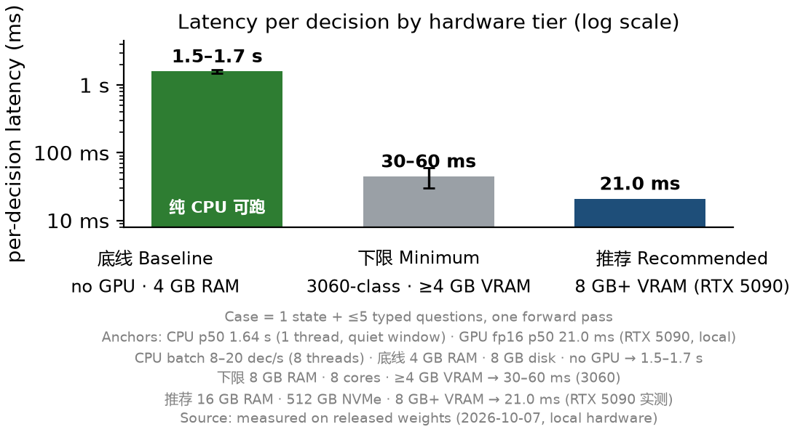

# Deployment Guide — Phocinae-Largha-150M-v1

How to run Largha locally: the decision service ([phocinae-server](https://github.com/Phocinae/phocinae-server)), the command approval gate ([phocinae-guard](https://github.com/Phocinae/phocinae-guard)), and the MCP bridge ([phocinae-mcp](https://github.com/Phocinae/phocinae-mcp)). Everything runs on your own machine; nothing is ever sent to a cloud service. **All components listen on 127.0.0.1 only by default — local inference, no cloud.**

## Contents

- [1. Hardware tiers](#1-hardware-tiers)
- [2. Decision service: phocinae-server](#2-decision-service-phocinae-server)
- [3. Approval gate: phocinae-guard](#3-approval-gate-phocinae-guard)
- [4. MCP bridge: phocinae-mcp](#4-mcp-bridge-phocinae-mcp)
- [5. Performance & reliability demos](#5-performance--reliability-demos)
- [6. Security statement](#6-security-statement)

## 1. Hardware tiers

<div align="center">
  
  <p><em>图 · 硬件三档：4 GB 无 GPU 1.5–1.7 s · 3060 级 30–60 ms · 8 GB+ 显存（RTX 5090 实测）21.0 ms</em></p>
</div>

| tier | RAM | storage | CPU | GPU | expected performance |
|---|---|---|---|---|---|
| **Baseline** (try it out) | 4 GB available | 8 GB | any 64-bit x86-64 / ARM64, ≥2 cores | none needed | ~1.5–1.7 s per case (CPU single-thread; 1 case = 5 decisions); loading ~4 s |
| **Minimum** (full efficiency) | 8 GB | 20 GB (SSD/NVMe) | 8 modern cores | ≥4 GB VRAM (RTX 3060-class → 30–60 ms; 8 GB+ VRAM → 21.0 ms, measured on RTX 5090) | GPU 21.0–60 ms/decision; CPU-only 8T: 8–20 decisions/s |
| **Recommended** (daily driver) | 16 GB (32 GB comfortable) | 512 GB NVMe | 12–16 cores | 8 GB+ consumer card | GPU 21.0 ms (RTX 5090)–25 ms/decision while other apps run; CPU batch in background |

Notes: the weights are 288.6 MB (fp16 safetensors); inference peaks ~1.6 GB VRAM / ~1.8 GB RAM. The 21.0 ms (RTX 5090) fp16 p50 is a high-end-GPU number — a CPU can never reach it; CPU-only users should budget ~1.64 s per single-threaded case, or use 8-thread batching (8–20 decisions/s).

## 2. Decision service: phocinae-server

```bash
pip install phocinae-server
# point at the downloaded model repo (this HF repo)
PHOC_MODEL_DIR=/path/to/Phocinae-Largha-150M-v1 python -m phocinae.main
# -> http://127.0.0.1:8155  (interactive docs at /docs)
```

From source (alternative): `git clone https://github.com/Phocinae/phocinae-server.git && cd phocinae-server && pip install .`

Environment:

| variable | default | purpose |
|---|---|---|
| `PHOC_MODEL_DIR` | required | path to this model repo |
| `PHOC_HOST` / `PHOC_PORT` | 127.0.0.1 / 8155 | listen address |
| `PHOC_DEVICE` | auto | `auto` / `cuda` / `cpu` (no GPU → falls back to CPU fp32) |
| `PHOC_PERM_AVG` | 0 | `1` = average choice questions over 4 option orders (lowers flips) |
| `PHOC_BEARER_TOKEN` | empty | set it → `/v1/*` requires `Authorization: Bearer <token>` |
| `PHOC_THREADS` | — | torch thread count in CPU mode |
| `PHOC_MAX_BODY` | 2 MiB | request-body cap (413 above it) |
| `PHOC_EXTENSIONS` | 1 | `0` = omit `answer_confidence`/`action`/`routing` extension keys |

Smoke test:

```bash
curl -s http://127.0.0.1:8155/health
curl -s http://127.0.0.1:8155/v1/systemone -H 'Content-Type: application/json' \
  -d '{"model":"Phocinae-Largha-150M-v1","state":"git status","questions":[{"id":"ok","type":"noul","threshold":0.65}]}'
```

## 3. Approval gate: phocinae-guard

A single-file, zero-dependency CLI gate (`allow` / `deny` / `ask` + exit code) for shell-command approval in coding agents (Claude Code, Cline, Codex CLI, dsh, Hermes, …).

```bash
git clone https://github.com/Phocinae/phocinae-guard.git && cd phocinae-guard
echo 'rm -rf /' | python3 guard.py          # exit 1 (deny)
python3 guard.py --command 'git status'     # exit 0 (allow)
python3 guard.py --command 'npm i -g x'     # exit 2 (ask -> human)
```

Layers:

- **L0** — deterministic whitelist/blacklist table (`l0_table.json`, pure offline): read-only commands allow, dangerous patterns (destructive rm, sudo dd/mkfs, curl|sh, git push --force, chmod 777, fork bombs, …) deny. Works even if the model server is down.
- **L1** — model decision via `/v1/systemone` (noul "approve?" + score "risk 2–10"). Thresholds: noul 0.65, ask ≥4, deny ≥7. **Off by default** (`PHOCINAE_GUARD_L1_ENABLED=0`): enable only after the model has been re-calibrated for your command-approval domain (the shipped weights were not fitted for this task).
- **fail-closed**: server unreachable → everything not on the whitelist is deny (or ask, via `PHOCINAE_GUARD_FAIL_CLOSED=ask`).

Exit codes: `0` allow · `1` deny · `2` ask (blocking, hook-level human confirm). Invariant: `--confirm` can only upgrade `ask` → `allow`, never override a `deny`. Audit trail: JSONL log (disable with `PHOCINAE_GUARD_AUDIT=off`).

Key env vars: `PHOCINAE_GUARD_SERVER` (default `http://127.0.0.1:8155`), `PHOCINAE_GUARD_TIMEOUT` (2.0 s), `PHOCINAE_GUARD_NOUL_THRESHOLD` (0.65), `PHOCINAE_GUARD_DENY_AT` (7.0), `PHOCINAE_GUARD_L1_ENABLED` (0), `PHOCINAE_GUARD_FAIL_CLOSED` (deny).

Demos: [S01_rmrf_gate.gif](./gallery/S01_rmrf_gate.gif) (rm -rf blocked) · [S02_curl_pipe_gate.gif](./gallery/S02_curl_pipe_gate.gif) (curl\|sh denied) · [G27_failclosed.gif](./gallery/G27_failclosed.gif) (server down → default deny).

## 4. MCP bridge: phocinae-mcp

MCP stdio server exposing the gate and the P0 decision protocol as tools for MCP-only agents (Cline, Windsurf, Zed, Codex CLI):

```bash
git clone https://github.com/Phocinae/phocinae-mcp.git && cd phocinae-mcp
python3 -m phocinae_mcp --version
```

Client config (Cline/Windsurf `mcpServers`):

```json
{
  "mcpServers": {
    "phocinae": {
      "command": "python3",
      "args": ["-m", "phocinae_mcp", "--server", "http://127.0.0.1:8155"],
      "env": { "PHOCINAE_MCP_L1_ENABLED": "0" }
    }
  }
}
```

Tools: `gate` (command → allow/deny/ask + layer + reason), `classify` (state + labels → choice), `route` (state + tools → chosen tool), `score` (state + criteria → 2–10). Fail-closed: service down → `gate` returns deny with a reason; other tools return explicit MCP errors.

## 5. Performance & reliability demos

- **Local vs API race**: [G25_race_local_vs_api.gif](./gallery/G25_race_local_vs_api.gif) — same decision, local 21.0 ms (RTX 5090) vs 1.51 s API round-trip (ours, n=40; third-party Jev API: 238–301 ms per decision).
- **Quickstart in three lines**: [S24_quickstart.gif](./gallery/S24_quickstart.gif) — pip install → serve → one decision.

## 6. Security statement

- All components listen on **127.0.0.1 only** by default and are unauthenticated on purpose — **do not expose them to a LAN or the public internet**. If you must bind elsewhere, set `PHOC_BEARER_TOKEN` and put the service behind your own auth/reverse proxy.
- The model is a **decision aid, not a security product**: a 144M classifier cannot replace sandboxing, least-privilege, or human review. Always pair the L1 model gate with the deterministic L0 table and route the gray zone to a human.
- Guard semantics are **fail-closed** (deny/ask on any error) and phocinae-server provides **no high-availability guarantees** — callers must treat crashes as "deny".
- All inference is local; no decision data leaves the machine.
