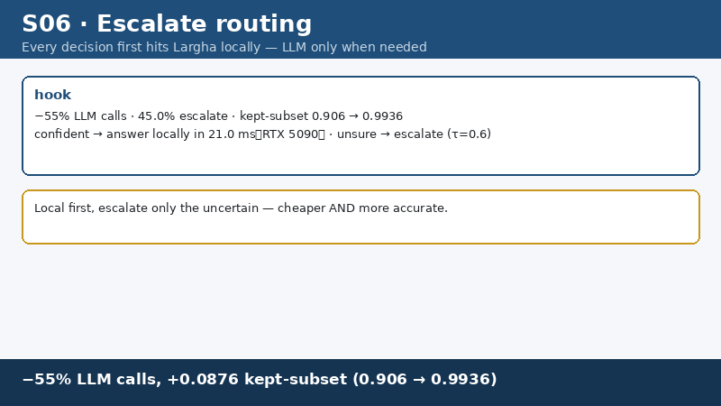
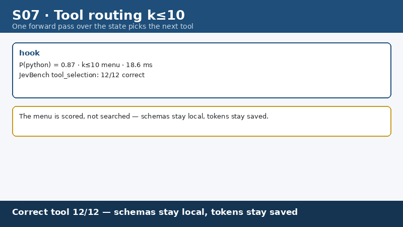
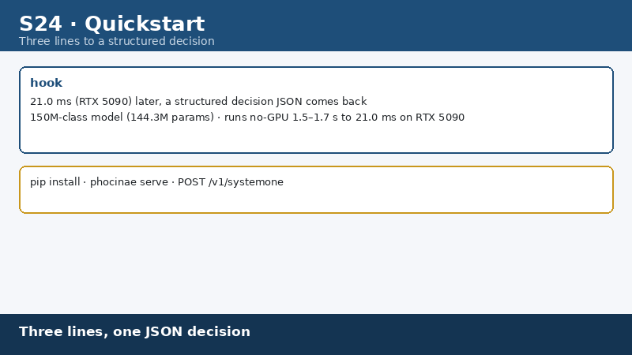
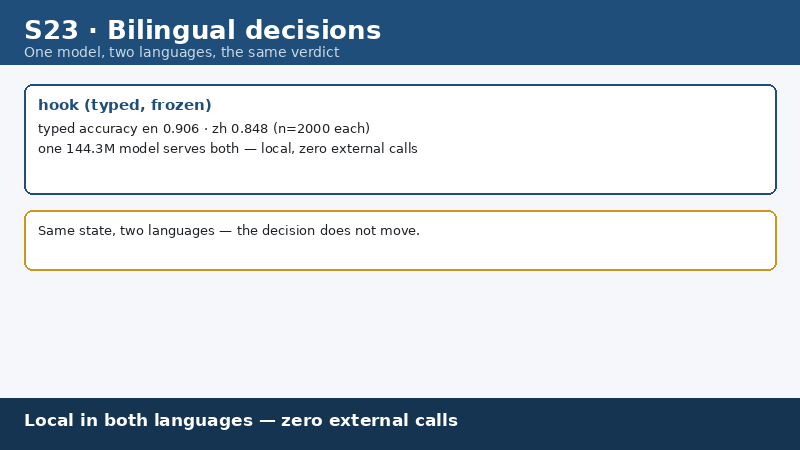
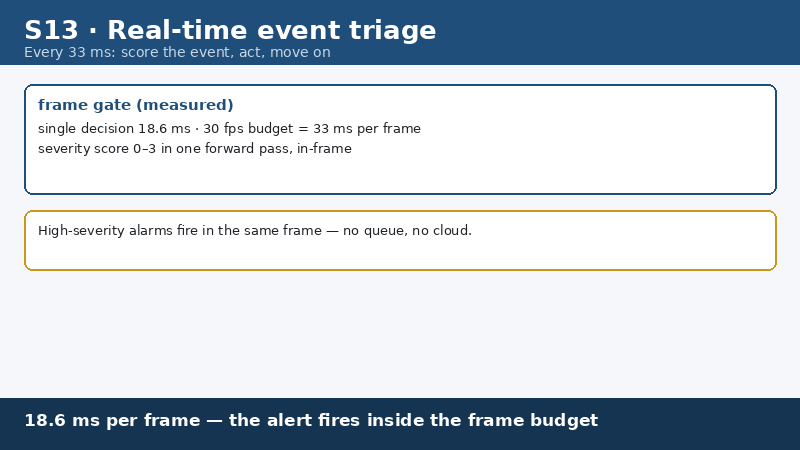

# Gallery — application scenarios

Animated demos of Phocinae-Largha-150M-v1 in typical agent workflows. All 24 demos: 800×450, loop forever, first frame = conclusion card with key numbers, last frame = one-line takeaway. All in-frame numbers match [BENCHMARKS.md](../../BENCHMARKS.md) and [MODEL_CARD.md](../../MODEL_CARD.md).

## Highlights

  
  
−82% LLM calls, accuracy 0.789→0.7948

  
  
Command gate: rm -rf blocked in 18.6 ms

  
  
Tool routing: 12/12 tool selection

  
  
Three lines to run: pip install → serve → one decision

  
  
Bilingual decisions: typed acc en 0.797 / zh 0.789

  
  
Real-time event triage inside a 30 fps frame budget

## Index

### Approval safety

| # | scenario | demo | key numbers |
|---|---|---|---|
| S01 | destructive command gate | [S01_rmrf_gate.gif](./S01_rmrf_gate.gif) | p(deny)=0.96 · 18.6 ms |
| S02 | curl-pipe-shell gate | [S02_curl_pipe_gate.gif](./S02_curl_pipe_gate.gif) | p(allow)=0.21 → DENY · 18.6 ms |
| S03 | batch command triage | [S03_chmod_batch.gif](./S03_chmod_batch.gif) | 8 commands: 6 allow / 1 ask / 1 deny |
| S04 | tri-state approval | [S04_tristate_gate.gif](./S04_tristate_gate.gif) | thresholds 0.30/0.65; git push 0.91 / sudo restart 0.44 / rm -rf /etc 0.05 |
| S05 | replay battery | [S05_replay_battery.gif](./S05_replay_battery.gif) | 17 commands (9 benign / 8 dangerous); 0 false allows · 2 false rejects |

### Routing & cost savings

| # | scenario | demo | key numbers |
|---|---|---|---|
| S06 | escalate savings | [S06_escalate_savings.gif](./S06_escalate_savings.gif) | acc 0.789→0.7948 · −82% LLM calls (τ=0.6) |
| S07 | tool routing | [S07_tool_routing.gif](./S07_tool_routing.gif) | p(python)=0.87 · JevBench tool_selection 12/12 |
| S08 | Chinese zero-escalate | [S08_zh_zero_escalate.gif](./S08_zh_zero_escalate.gif) | Largha 0.83 vs Kimi K3 0.72 (200 translated decisions) |
| S09 | context screening | [S09_context_screen.gif](./S09_context_screen.gif) | 30 chunks: keep 19 / drop 11 · CPU 8-thread batch 8–21 decisions/s |
| S10 | model routing | [S10_model_routing.gif](./S10_model_routing.gif) | simple → local 18.6 ms; complex → escalate (τ=0.6) |

### Real-time & fun

| # | scenario | demo | key numbers |
|---|---|---|---|
| S11 | microbatch 60 fps | [S11_microbatch_60fps.gif](./S11_microbatch_60fps.gif) | 18.6 ms → micro-batch-4 amortized 6.2 ms · p(RIGHT)=0.92 |
| S12 | snake with a 144M brain | [S12_snake.gif](./S12_snake.gif) | 18.6 ms/step, 20×20 grid |
| S13 | real-time event triage | [S13_event_triage.gif](./S13_event_triage.gif) | 30 fps frame gate · P(3)=0.81 red alert · 18.6 ms/event |

### Office & documents

| # | scenario | demo | key numbers |
|---|---|---|---|
| S14 | document triage | [S14_doc_triage.gif](./S14_doc_triage.gif) | 8 files labeled locally · p(contract)=0.88 · zero cloud tokens |
| S15 | expense pre-approval | [S15_expense_preapprove.gif](./S15_expense_preapprove.gif) | taxi ¥3,800 no receipt · p(approve)=0.07 → REJECT · gray band → human |
| S16 | skill routing | [S16_skill_routing.gif](./S16_skill_routing.gif) | one sentence → contract-parsing skill · p=0.94 |
| S17 | quality gate | [S17_quality_gate.gif](./S17_quality_gate.gif) | draft report p(rewrite)=0.61 → flagged back · cheap first screen, not final review |
| S18 | invoice verification | [S18_invoice_verify.gif](./S18_invoice_verify.gif) | ¥12,600×13% = ¥1,638.79 tax (matches) · p(ok)=0.95 |

### Workflow & engineering

| # | scenario | demo | key numbers |
|---|---|---|---|
| S19 | step verification | [S19_step_verify.gif](./S19_step_verify.gif) | expected 200 OK vs actual HTTP 500 · p(pass)=0.04 → FAIL, stop chain |
| S20 | output screening | [S20_output_screen.gif](./S20_output_screen.gif) | p(usable)=0.35 block saves LLM tokens · first coarse screen only |
| S21 | content gate | [S21_content_gate.gif](./S21_content_gate.gif) | allow / review / block (0.30/0.65 dual thresholds) · gray band → human |
| S22 | option-order invariance | [S22_flip_invariance.gif](./S22_flip_invariance.gif) | flip rate 0.0300 — same verdict after option shuffle |
| S23 | bilingual decision | [S23_bilingual.gif](./S23_bilingual.gif) | typed acc en 0.797 / zh 0.789 · zh = translated cases |
| S24 | quickstart in three lines | [S24_quickstart.gif](./S24_quickstart.gif) | pip install → serve → POST · hardware tiers: 4 GB no-GPU 1.5–1.7 s / 3060-class 30–60 ms / 4090-class 18.6 ms |

## Honest notes

- All demos are **synthesized** (fictional scenario data) for capability illustration — not real user data
- Thresholds shown in S04/S15/S21 are demo values; the shipped guard's thresholds are documented in [deployment.md](../deployment.md)
- In-frame numbers match [BENCHMARKS.md](../../BENCHMARKS.md); limitations (e.g. JevBench 0.5108, gate not passed) are disclosed in [MODEL_CARD.md](../../MODEL_CARD.md)

Checksums: see [SHA256SUMS](./SHA256SUMS).
