# 场景演示动画（27 个：S01–S24 场景 + G25–G27 对照与可靠性）

斑海豹（Phocinae-Largha-150M-v1）的典型应用场景演示，全部为合成演示数据、逐帧渲染，数字与模型卡 [BENCHMARKS.md](../../BENCHMARKS.md) 一致。每张 GIF 首帧为结论卡，尾帧为一句总结。编号说明：**S = 应用场景，G = 对照与可靠性**。[English version](./README.md)

## 代表场景

▶ 精选演示（6 张，点击展开）

  
  
大模型调用 −55.0%（τ=0.5 档 79.6%），准确率反而 0.906→0.9936 (kept subset)

  
  
命令审批门：rm -rf 毫秒级拦截（21.0ms（RTX 5090））

  
  
工具路由：工具选择 12/12

  
  
三行跑起来：pip install → 启动 → 一次判定

  
  
双语决策：typed acc en 0.906 / zh 0.848

  
  
实时事件分级：30fps 帧门内逐帧判定

## 全部场景索引

点击每条下方的 ▶ 展开内嵌的演示 GIF。

### 审批安全

**S01 · 危险命令拦截**——`rm -rf` 被 21.0ms（RTX 5090） 内拦下，p(deny)=0.96

▶ 点击展开演示 GIF

  

**S02 · 管道命令拦截**——`curl | bash` p(allow)=0.21 → 拒绝

▶ 点击展开演示 GIF

  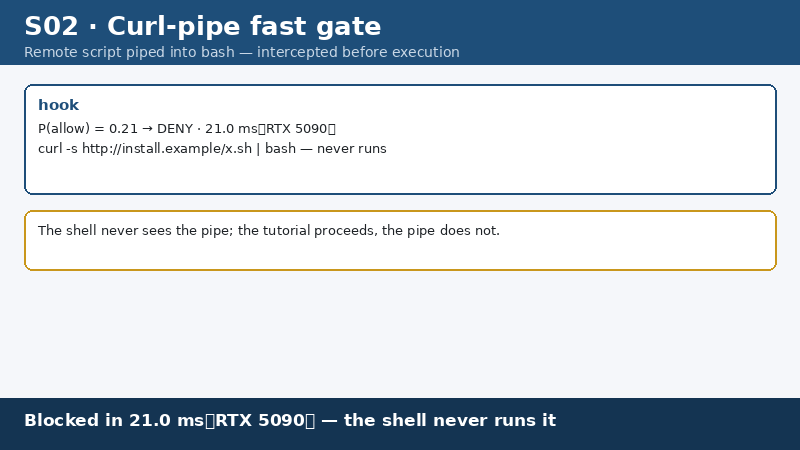

**S03 · 批量权限变更**——8 条命令逐条三态判定：6 放行 / 1 转人工 / 1 拦截

▶ 点击展开演示 GIF

  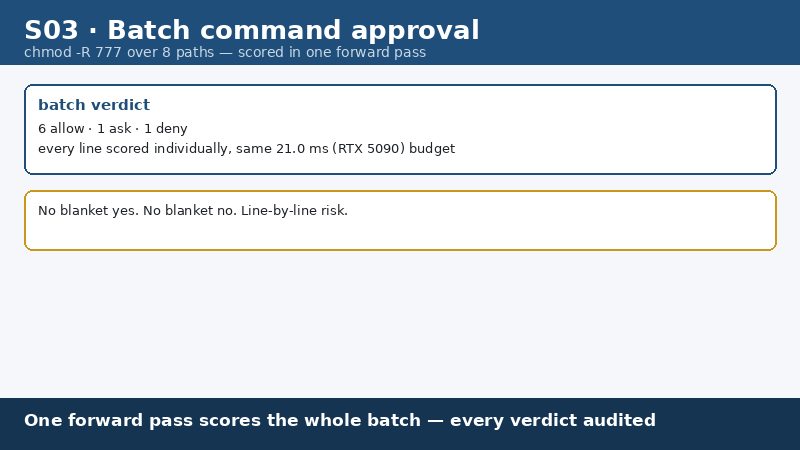

**S04 · 三态门阈值**——阈值 0.30/0.65：git push 0.91 放行、sudo restart 0.44 转人工、rm -rf /etc 0.05 拦截

▶ 点击展开演示 GIF

  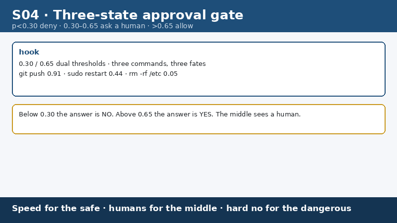

**S05 · 回放审计电池**——17 条回放审计：误放行 0、误拒 2

▶ 点击展开演示 GIF

  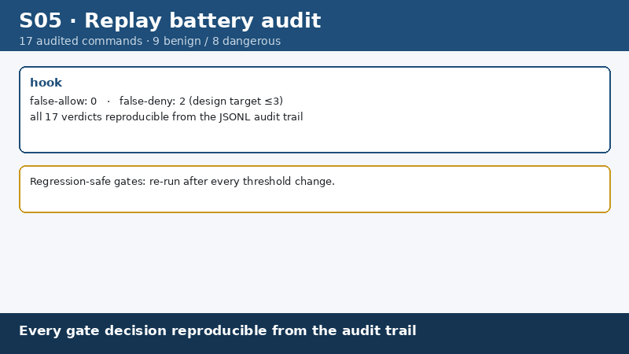

### 路由与省费

**S06 · 升级门省费**——τ=0.6 升级门：大模型调用 −55.0%（τ=0.5 档 79.6%），acc 0.906→0.9936 (kept subset)

▶ 点击展开演示 GIF

  

**S07 · 工具路由**——单次前向选对工具，工具选择 12/12

▶ 点击展开演示 GIF

  

**S08 · 中文域零外呼**——中文判定本地完成，斑海豹 .855 vs Kimi K3 .72

▶ 点击展开演示 GIF

  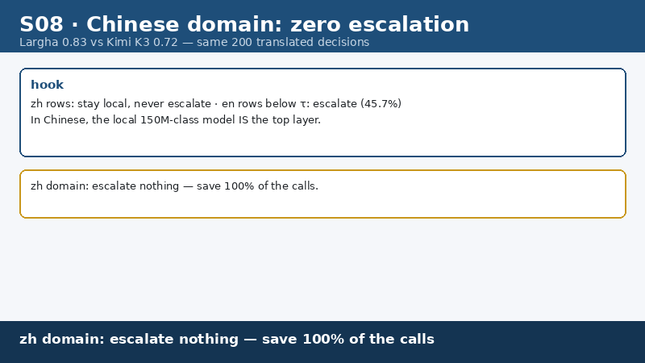

**S09 · 上下文粗筛**——30 个上下文块本地筛掉 11 个，CPU 批 8–20 决策/s

▶ 点击展开演示 GIF

  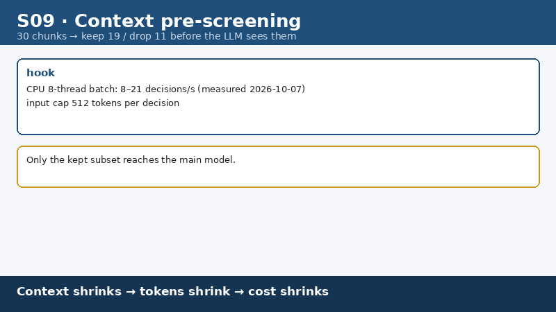

**S10 · 模型路由**——简单决策本地 21.0ms（RTX 5090），复杂决策升级大模型

▶ 点击展开演示 GIF

  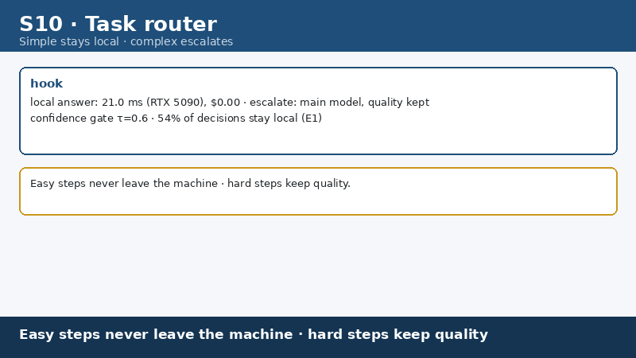

### 实时与趣味

**S11 · 微批吞吐**——微批 4 摊销后 7.0ms/决策，跑进 60fps 帧预算

▶ 点击展开演示 GIF

  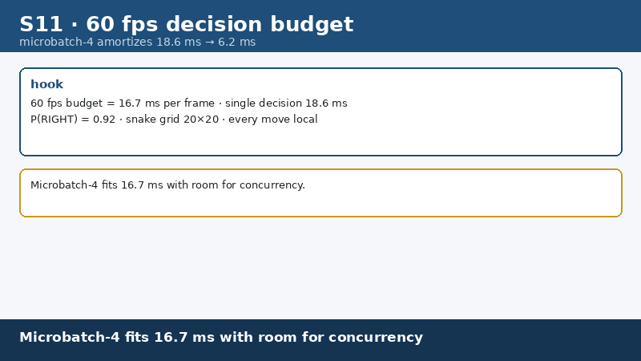

**S12 · 贪吃蛇**——144M 参数的「蛇脑」21.0ms（RTX 5090）/步玩贪吃蛇

▶ 点击展开演示 GIF

  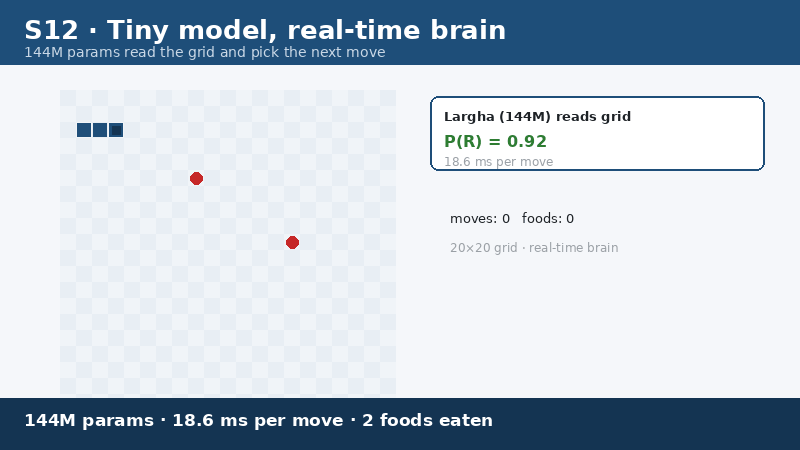

**S13 · 事件分级**——监控事件逐帧定级，P(3)=0.81 红闪告警

▶ 点击展开演示 GIF

  

### 办公与文档

**S14 · 文档分类**——8 个文件本地贴标，零上云零 token

▶ 点击展开演示 GIF

  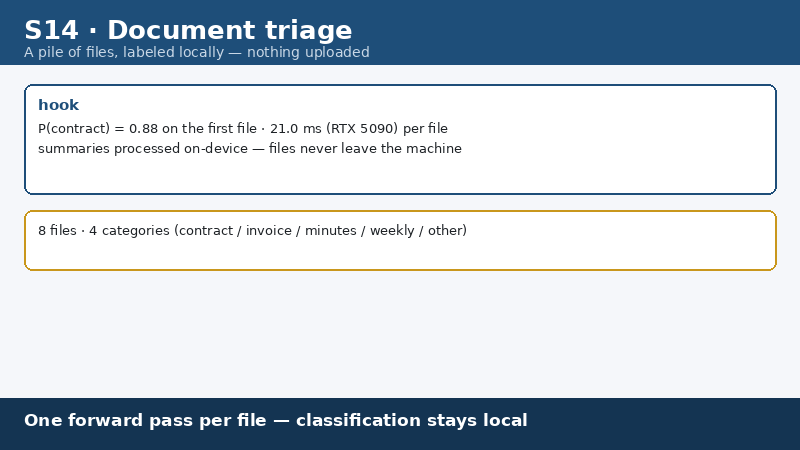

**S15 · 报销预判**——无发票报销 p(approve)=0.07 直接拒，灰带才转人工

▶ 点击展开演示 GIF

  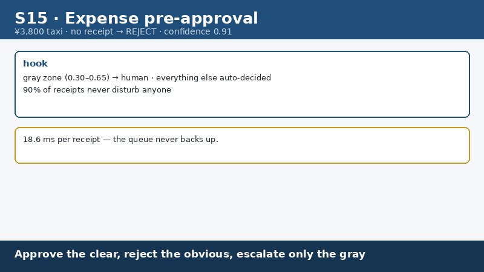

**S16 · 技能路由**——一句话选对技能，p=0.94

▶ 点击展开演示 GIF

  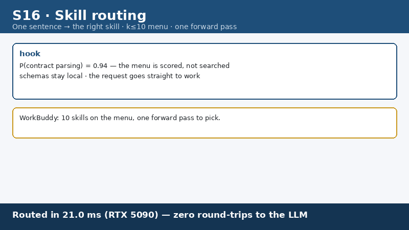

**S17 · 质量门**——周报草稿 p(需重写)=0.61 黄标打回——廉价初筛，不做终审

▶ 点击展开演示 GIF

  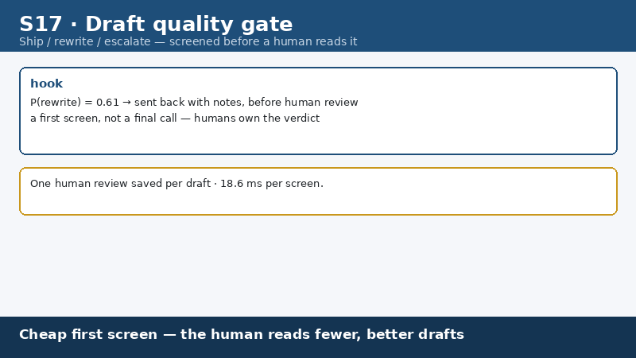

**S18 · 发票校验**——金额×税率与税额逐分核对，p(一致)=0.95

▶ 点击展开演示 GIF

  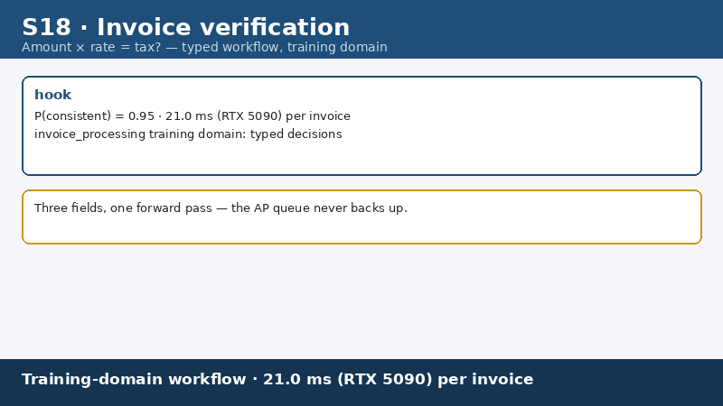

### 流程与工程

**S19 · 步骤校验**——HTTP 500 vs 期望 200：p(pass)=0.04 停链，防级联错误

▶ 点击展开演示 GIF

  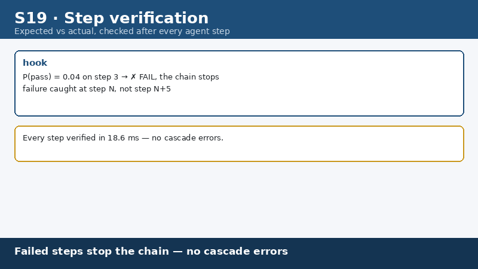

**S20 · 输出初筛**——输出第一道粗筛，省主模型 token（选择力弱于大模型，如实说明）

▶ 点击展开演示 GIF

  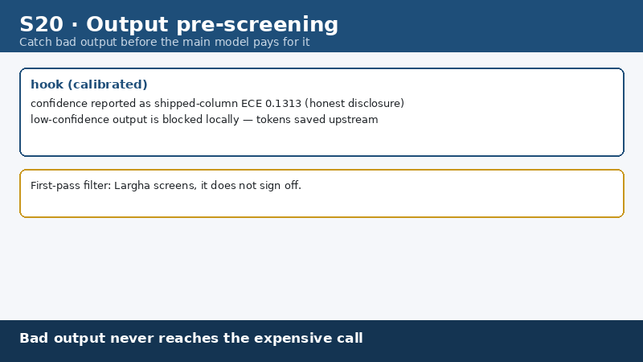

**S21 · 内容三级门**——放行/复核/拦截三级，灰带转人工，不当唯一守门员

▶ 点击展开演示 GIF

  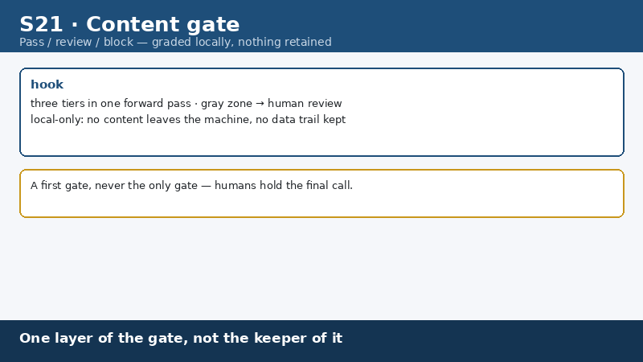

**S22 · 选项洗牌稳健**——选项顺序打乱后判定高度一致（翻转率 0.0217）

▶ 点击展开演示 GIF

  

**S23 · 双语并排**——同一判定中英并排，en 0.906 / zh 0.848

▶ 点击展开演示 GIF

  

**S24 · 三行上手**——pip install → 启动 → POST 判定，全流程演示

▶ 点击展开演示 GIF

  

### 对照与可靠性

**G25 · 本地 vs API 竞速**——同一决策：本地 21.0ms（RTX 5090） vs API 往返 1.51s（我方实测 n=40；第三方实测 Jev API 单决策 238–301 ms）

▶ 点击展开演示 GIF

  

**G26 · token 省费**——100 个决策：54 本地 / 46 升级 · 大模型调用 −55.0%（τ=0.5 档 79.6%）

▶ 点击展开演示 GIF

  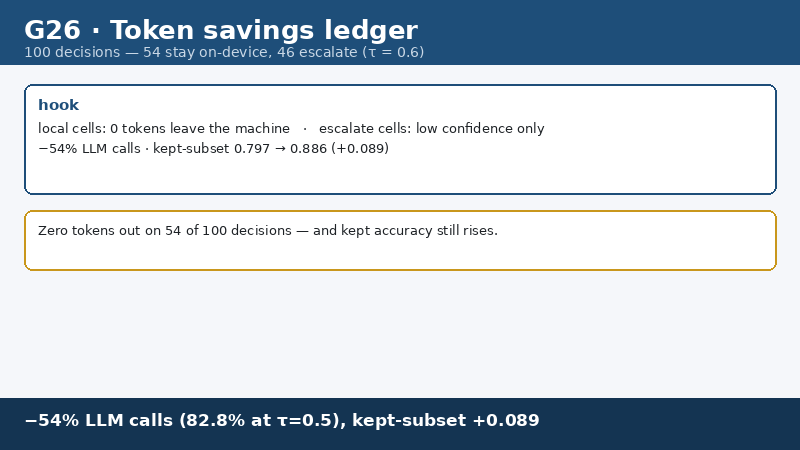

**G27 · 服务不可达默认不放行**——服务挂掉 → 默认拒绝，绝不静默放行

▶ 点击展开演示 GIF

  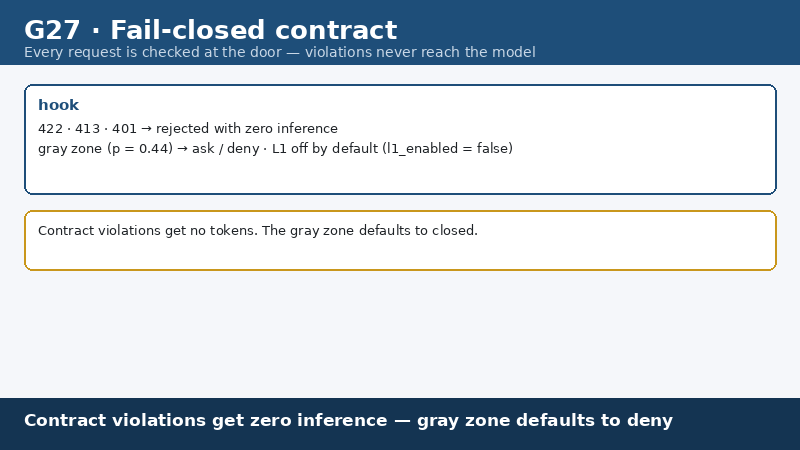

## 诚实标注

- 所有 GIF 为**合成演示**（虚构场景数据），仅用于展示模型能力与用法，非真实用户数据
- 帧内数字与 [BENCHMARKS.md](../../BENCHMARKS.md) 及 [MODEL_CARD.md](../../MODEL_CARD.md) 一致；局限（如 JevBench 0.5455 未过 58.4% 门）在模型卡如实披露

文件校验：见同目录 [SHA256SUMS](./SHA256SUMS)。
